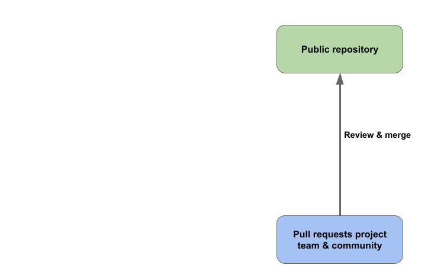
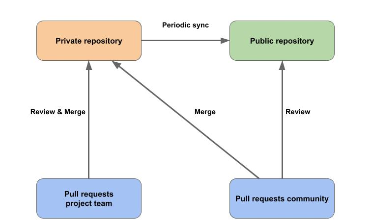

# Contributing guidelines

## What do I need to know to help?

If you are looking to help to with a code contribution our project uses GitHub to manage reviews of pull requests.

## Private vs public repos

We distinguish between two routes to contribute to code bases of projects, in which we recognize:
- code completely public and accessible
- code sourced from private repository here or elsewhere

For projects that only work with public repos, the way of contributing for project team and community is the same and speaks for itself.

For code sourced from private repository here or elsewhere, we distinguish between PRs of the project team and those of the community.

## How do I make a contribution?

Never made an open source contribution before? Wondering how contributions work in the in our project? Here's a quick rundown!

1. Find or create an issue that you are interested in addressing or a feature that you would like to add.
2. Fork the repository associated with the issue to your local GitHub organization. This means that you will have a copy of the repository under **your-GitHub-username/repository-name**.
3. Clone the repository to your local machine using `git clone https://github.com/github-username/repository-name.git`.
4. Create a new branch for your fix using `git checkout -b branch-name-here`.
5. Make the appropriate changes for the issue you are trying to address or the feature that you want to add.
6. Use git `add insert-paths-of-changed-files-here` to add the file contents of the changed files to the "snapshot" git uses to manage the state of the project, also known as the index.
7. Use `git commit -m "Insert a short message of the changes made here"` to store the contents of the index with a descriptive message.
8. Push the changes to the remote repository using `git push origin branch-name-here`.
9. Submit a pull request to the upstream repository.
10. Title the pull request with a short description of the changes made and the issue or bug number associated with your change. For example, you can title an issue like so `"Added more log outputting to resolve #52"`.
11. In the description of the pull request, explain the changes that you made, any issues you think exist with the pull request you made, and any questions you have for the maintainer. It's OK if your pull request is not perfect (no pull request is), the reviewer will be able to help you fix any problems and improve it!
12. Wait for the pull request to be reviewed by a maintainer.
13. Make changes to the pull request if the reviewing maintainer recommends them.
14. Celebrate your success after your pull request is merged!

## Where can I go for help?

If you need help on a specific repositiory, you can ask the repository owners.
If you need help on MinBZK repositories in general, you can e-mail opensource@minbzk.nl.

## What does the Code of Conduct mean for me?

Our  means that you are responsible for treating everyone on the project with respect and courtesy regardless of their identity. If you are the victim of any inappropriate behavior or comments as described in our Code of Conduct, we are here for you and will do the best to ensure that the abuser is reprimanded appropriately, per our code.
