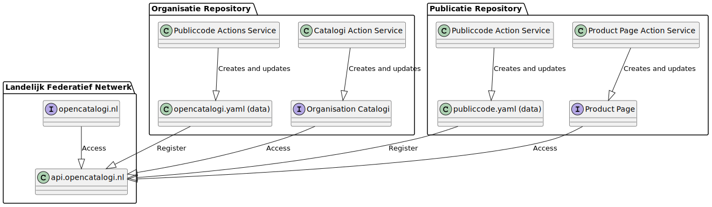

> Onderstaande tekst komt van de OpenCatalogi [site](https://documentatie.opencatalogi.nl/), een federatieve catalogus, passend in het nieuwe informatielandschap Common Ground.
>
> Aanleiding is een experiment met toevoegen van https://regels.overheid.nl/ zoals verwoord in [issue #321](https://github.com/MinBZK/regels.overheid.nl/issues/321).

# Welkom bij de documentatie van open catalogi!

OpenCatalogi creëert een krachtig federatief systeem dat informatie verzamelt van verschillende overheidsorganisaties, deze indexeert en u de mogelijkheid biedt om deze index te gebruiken of uw eigen index te starten. Met behulp van API's en gestandaardiseerde dataformaten kunnen verschillende entiteiten hun informatie naadloos integreren in één federatieve catalogus. De React-frontend is gebaseerd op NL Design en kan worden aangepast aan de huisstijl van uw organisatie met behulp van Design Tokens.

Wat OpenCatalogi uniek maakt, is dat de frontend serverless (via GitHub) kan draaien, waardoor deelnemende organisaties OpenCatalogi niet zelf hoeven te installeren om het te kunnen gebruiken. Zowel de frontend als de gegevens kunnen worden gehost op GitHub.
Opzet

# De basismodule van Open Catalogi bestaat uit drie hoofdcomponenten:

- Een genetwerkte omgeving voor het uitwisselen van gegevens, met een eigen zoekpagina.
- Repositories die informatie leveren aan het netwerk (bijvoorbeeld [Open WOO](https://github.com/ConductionNL/woo-website-template)) en optioneel een eigen pagina hebben (bijvoorbeeld https://openwoo.app/).
- Organisaties die informatie leveren aan het netwerk (bijvoorbeeld [Open Webconcept](https://github.com/OpenWebconcept)) en optioneel een eigen catalogus hebben (bijvoorbeeld [Open Webconcept](https://openwebconcept.github.io/.github/)).

Met andere woorden, repositories en organisaties wisselen gegevens uit binnen het netwerk en met zichzelf.

In een meer geavanceerde opzet kunnen ook andere bronnen dan repositories worden gebruikt (zoals API's) en kunnen organisaties hun eigen knooppunten starten. Meer informatie hierover vindt u in de architectuursectie.